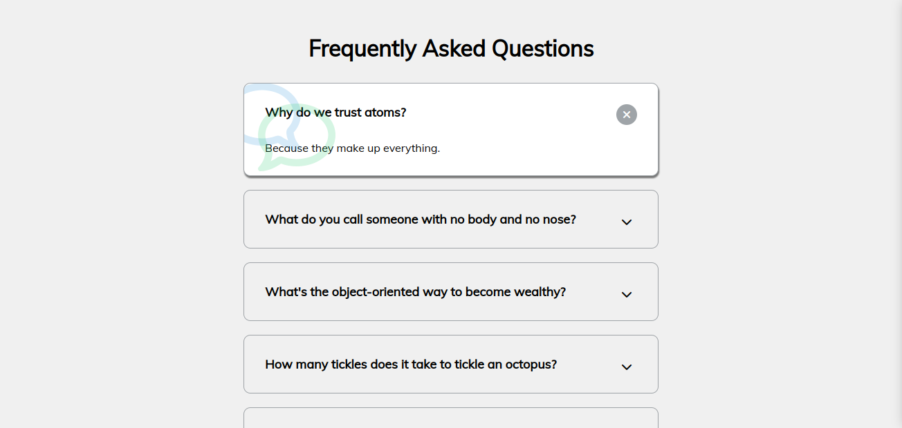
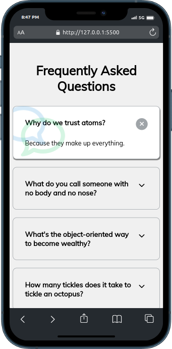

# 50 projects in 50 days - Creating a FAQ page with interactive features.

## Table of contents

- [Overview](#overview)
  - [The challenge](#the-challenge)
  - [Screenshot](#screenshot)
- [My process](#my-process)
  - [Built with](#built-with)
  - [What I learned](#what-i-learned)
  - [Continued development](#continued-development)
  - [Useful resources](#useful-resources)
- [Author](#author)

## Overview

### The challenge

This FAQ project allows users to view frequently asked questions in an accordion style, all questions can be opened at once.

### Screenshot




## My process

### Built with

- HTML5 markup.
- Font Awesome for icons.
- CSS Flexbox for layout and styling.
- CSS positioning for element placement.
- Javascript (DOM manipulation).

### What I learned

I learned how to use font awesome to add high-quality icons to my projects. I also learned how to use parentNode to efficiently target the parent FAQ section when a button is clicked. This helped to simplify the code for opening and closing the accordion elements.

Here's an example of how I used Font Awesome icons:

```css
.faq.active::before,
.faq.active::after {
  content: "\f075";
  font-family: "Font Awesome 6 Free";
  color: #2ecc71;
}
```

parentNode in my code:

```js
button.parentNode.classList.add("active");
```

### Continued development

I'd like to continue learning about advanced JavaScript features to potentially improve the code's efficiency. I'm also interested in adding features like search functionality to allow users to easily find specific questions within the FAQ.

### Useful resources

- [Font Awesome Icons](https://fontawesome.com/).

## Author

- Linkedin - [Bienvenu Cyuzuzo](https://www.linkedin.com/in/bienvenu-cyuzuzo/)

**Note: This readme is heavily inspired by the frontend mentor readme template (https://www.frontendmentor.io/challenges/).**
